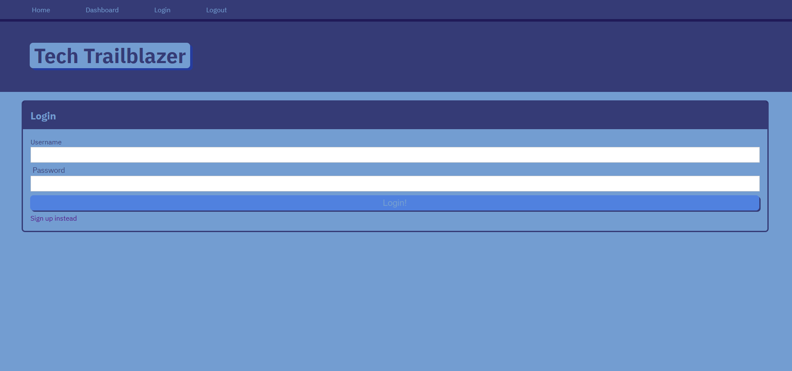

# Tech-Trailblazer
  -  A CMS-style blog site to publish articles, blog posts, and thought/opinions.

## Description
-  A CMS-style blog site to publish articles, blog posts, and thought/opinions.
- I wished to make a blog where developers can publish blogs and comment on other developer's posts. 
- This application added another form of communicion between all types of developers who also wish to solve problems.

## Table of Contents
- [Installation](#installation)
- [Usage](#usage)
- [License](#license)
- [Questions](#questions)

## Usage

- Homepage with login  
- Navigation bar  
- Existing blog posts with option to leave a comment  

## License

This project is licensed under the [None](https://opensource.org/licenses/None) License - see the [LICENSE](LICENSE) file for details.

## Feature(s)
- Login/Logout Button  
- A reply comment for blogposts  
- A post button for new blogs

## Credits
- [GitLab UNCC Bootcamp](https://git.bootcampcontent.com/UNC-Charlotte/UNCC-VIRT-FSF-PT-07-2023-U-LOLC -/tree/main/14-MVC?ref_type=heads)  
- [Handlebars js Guide](https://handlebarsjs.com/guide/)  
- [Express Handlebars npm](https://www.npmjs.com/package/express-handlebars)  
- [Heroku Guide](https://coding-boot-camp.github.io/full-stack/heroku/deploy-with-heroku-and-mysql) 

## Deployment
- [GitHub Repository](https://github.com/Develepor-Dan/Tech-Trailblazer)
- [Deployed Application](https://tech-trailblazer-cdf830924b75.herokuapp.com/login)

## Questions
For questions and contributions to the project, please contact [Daniel Zavala](mailto:zavaladaniel151@gmail.com).